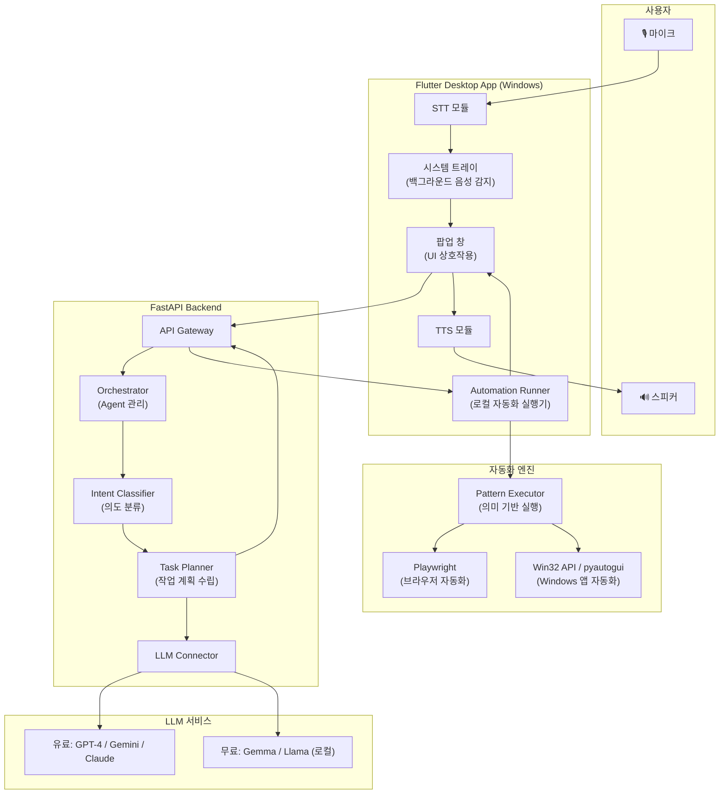
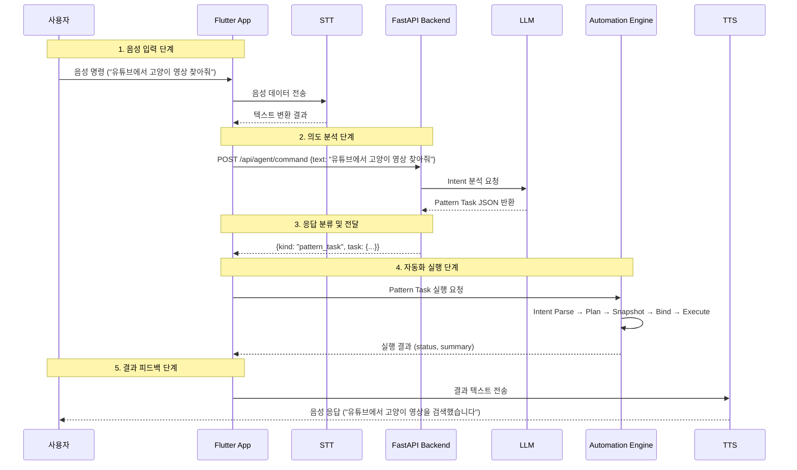
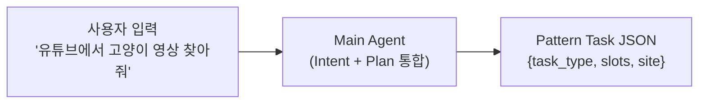
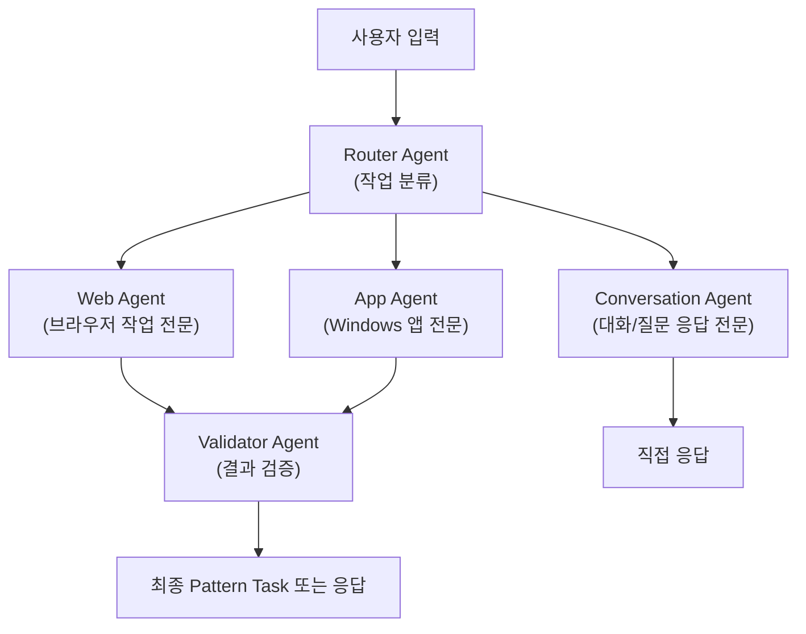
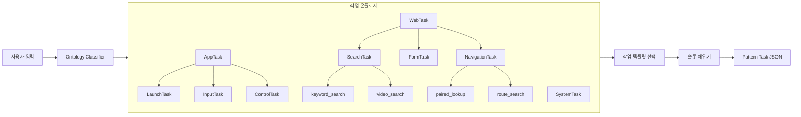

# Navi 시스템 아키텍처 설계

## 1. 전체 시스템 구조



---

## 2. 데이터 흐름 상세



---

## 3. 모듈별 상세 설계

### 3.1 STT 모듈

| 항목 | 설계 |
|------|------|
| **위치** | Flutter App 내부 (로컬 처리 우선) |
| **1순위** | Whisper (로컬, 오프라인 가능, 한국어 지원) |
| **2순위** | Google Cloud STT (온라인, 높은 정확도) |
| **3순위** | Azure Speech Services (온라인, 실시간 스트리밍) |
| **Wake Word** | "나비야" 또는 사용자 설정 가능한 wake word |
| **동작 방식** | 백그라운드 VAD(Voice Activity Detection) → wake word 감지 → 전체 STT 활성화 |

> [!IMPORTANT]
> Wake word 감지는 경량 모델로 항상 돌리되, 전체 STT는 wake word 감지 후에만 활성화하여 리소스를 절약한다.

### 3.2 LLM 모듈 (Agent 아키텍처)

#### 3.2.1 단일 Agent 구조 (1차 목표)



사용자의 자연어 입력을 받아 **하나의 Agent**가 직접 Pattern Task JSON을 생성한다.

- **장점**: 단순한 구조, 빠른 응답, 낮은 비용
- **단점**: 복잡한 다단계 작업에서 정확도 저하 가능
- **적용**: 검색, 길찾기 등 단일 의도 작업

#### 3.2.2 Multi-Agent 구조 (2차 목표 — Sub-Agent 하네싱)



- **Router Agent**: 요청을 분류하여 적절한 전문 Agent에 위임
- **Web Agent**: 브라우저 자동화 전용 (keyword_search, paired_lookup 등)
- **App Agent**: Windows 앱 실행/조작 전용 (app_launch, app_interact 등)
- **Conversation Agent**: 단순 질문응답, 안내, 확인 전용
- **Validator Agent**: 생성된 Plan의 유효성 검증

#### 3.2.3 온톨로지 기반 개선 (3차 목표)



- 작업 유형을 **계층적 온톨로지**로 구조화
- 새로운 작업 유형 추가 시 온톨로지에 노드 추가만으로 확장 가능
- LLM은 온톨로지 분류 + 슬롯 채우기에 집중

### 3.3 TTS 모듈

| 항목 | 설계 |
|------|------|
| **위치** | Flutter App 내부 |
| **1순위** | Edge TTS (무료, 한국어 고품질) |
| **2순위** | Google Cloud TTS (유료, 최고 품질) |
| **3순위** | Azure Neural TTS (유료, 감정 표현 가능) |
| **속도 조절** | 사용자 설정 가능 (0.5x ~ 2.0x) |
| **음성 선택** | 남성/여성/톤 선택 가능 |

> [!TIP]
> 시각장애인 사용자는 보통 빠른 TTS 속도를 선호한다. 기본값을 1.2x~1.5x로 설정하고 사용자가 조정할 수 있도록 한다.

### 3.4 자동화 엔진

#### 브라우저 자동화 (Playwright 기반 — 기존 구조 유지)

```
Pattern Task JSON
    → Intent Parser (task_type + slots 해석)
    → Pattern Planner (action sequence 생성)
    → Snapshot Builder (현재 화면 분석)
    → Pattern Binder (실행 대상 요소 선택)
    → Action 실행
    → Recovery (실패 시 복구)
    → 결과 읽기
```

#### Windows 앱 자동화 (신규 확장)

```
App Task JSON
    → App Intent Parser (app_name + action + params 해석)
    → App Launcher (Win32 API / subprocess로 앱 실행)
    → UI Automation (pyautogui / UI Automation Framework)
    → 결과 확인
```

| 계층 | 도구 | 역할 |
|------|------|------|
| 앱 실행 | `subprocess` / `os.startfile` / `Win32 ShellExecute` | 프로그램 실행 |
| UI 탐색 | `pywinauto` / `UI Automation` | 앱 내 UI 요소 탐색 |
| 입력 시뮬레이션 | `pyautogui` / `Win32 SendInput` | 키보드/마우스 시뮬레이션 |
| 화면 캡처 | `PIL` / `mss` | 현재 화면 상태 확인 |

---

## 4. 통신 프로토콜

### Flutter ↔ FastAPI

```
POST /api/v1/command
Content-Type: application/json

Request:
{
  "text": "유튜브에서 고양이 영상 찾아줘",
  "session_id": "abc-123",
  "context": {
    "previous_action": null,
    "current_page": null
  }
}

Response (3가지 형태 중 하나):
1. 일반 대화 응답 → UI에 텍스트 표시 + TTS
2. Pattern Task → 브라우저 자동화 실행
3. App Task → Windows 앱 자동화 실행
```

### Flutter ↔ Local Automation Engine

```
Pattern Task / App Task JSON
    → Python subprocess 또는 로컬 HTTP 서버
    → 실행 결과 JSON 반환
    → Flutter UI 업데이트 + TTS 피드백
```

---

## 5. 접근성 설계 원칙

| 원칙 | 구현 |
|------|------|
| **음성 우선** | 모든 상호작용이 음성으로 가능해야 한다 |
| **즉시 피드백** | 모든 상태 변화를 TTS로 즉시 알려야 한다 |
| **오류 회복** | "다시 해줘", "취소해줘" 등 음성 명령으로 복구 가능 |
| **키보드 대체** | 음성 외에 키보드 단축키로도 모든 기능 접근 가능 |
| **고대비 UI** | 저시력 사용자를 위한 고대비/큰 글자 모드 |
| **스크린리더 호환** | NVDA, JAWS 등 기존 스크린리더와 충돌하지 않는 구조 |
