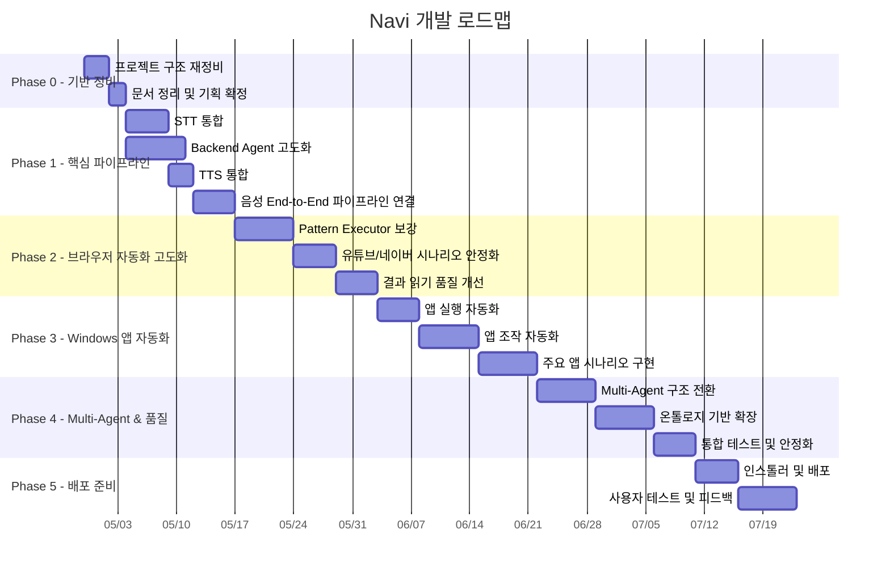

# Navi 개발 로드맵

## 전체 Phase 구조

---

## Phase 0 — 기반 정비 (현재)

> 기존 코드베이스 정리, 프로젝트 구조 확정, 문서 작성

| 완료 기준 |
|-----------|
| docs 폴더에 기획/아키텍처/기술검토/로드맵/태스크 문서 작성 완료 |
| 프로젝트 폴더 구조 확정 |
| 기존 코드 동작 확인 |

---

## Phase 1 — 핵심 음성 파이프라인

> 음성 입력 → LLM 분석 → 자동화 실행 → 음성 출력의 전체 루프 완성

### 1.1 STT 통합
- Whisper 로컬 서버 구축 또는 Flutter 플러그인 연동
- VAD(Voice Activity Detection) 구현
- Wake word 감지 ("나비야" 등)
- 실시간 음성 텍스트 변환 파이프라인

### 1.2 Backend Agent 고도화
- 기존 IntentParser를 Pattern Task 지원하도록 확장
- 프롬프트 최적화 (agent_api_json_contract_ko.md 기반)
- LLM 제공자 교체 가능한 어댑터 패턴 구현
- 세션 관리 및 대화 컨텍스트 유지

### 1.3 TTS 통합
- Edge TTS 연동
- 음성 속도/톤 설정 기능
- 실행 상태 음성 피드백 (시작/진행/완료/오류)

### 1.4 End-to-End 연결
- Flutter ↔ STT ↔ Backend ↔ Automation ↔ TTS 전체 루프
- 상태 전이 관리 (listening → processing → executing → speaking)

---

## Phase 2 — 브라우저 자동화 고도화

> 기존 Pattern Executor를 실 사용 수준으로 안정화

### 2.1 Pattern Executor 보강
- 더 많은 사이트/시나리오 패턴 추가
- Binder 점수 알고리즘 개선
- Recovery 로직 강화
- Snapshot 상태 판단 정확도 향상

### 2.2 핵심 시나리오 안정화
- 유튜브 검색 + **영상 재생** (첫 결과 클릭)
- 네이버 지도 경로 탐색 + **결과 읽기**
- 구글/네이버 검색 + 결과 요약

### 2.3 결과 읽기 품질 개선
- 결과 영역 정밀 추출 (카드 단위)
- 구조화된 결과 요약 생성
- TTS에 최적화된 결과 포맷팅

---

## Phase 3 — Windows 앱 자동화

> 브라우저를 넘어 Windows 앱까지 자동화 범위 확장

### 3.1 앱 실행 자동화
- 앱 이름 → 실행 경로 매핑 DB 구축
- `subprocess` / `ShellExecute` 기반 앱 실행
- 실행 확인 (프로세스 존재 체크)

### 3.2 앱 조작 자동화
- `pywinauto` / `UI Automation` 기반 앱 내 UI 탐색
- `pyautogui` 기반 키보드/마우스 시뮬레이션
- 앱 상태 감지 (활성 윈도우, 포커스 등)

### 3.3 주요 앱 시나리오
- 메모장: 열기 → 텍스트 입력 → 저장
- 엑셀: 열기 → 셀 선택 → 데이터 입력
- 카카오톡: 열기 → 채팅방 검색 → 메시지 입력 → 전송
- 동영상 플레이어: 파일 열기 → 재생/일시정지/볼륨 조절

---

## Phase 4 — Multi-Agent & 품질 고도화

> Agent 구조 확장 및 전체 시스템 안정성 강화

### 4.1 Multi-Agent 구조
- Router Agent (작업 분류)
- Web Agent / App Agent / Conversation Agent 분리
- Validator Agent (결과 검증)

### 4.2 온톨로지 기반 확장
- 작업 유형 계층 구조 설계
- 새 task_type 추가 시 코드 변경 최소화
- 템플릿 기반 Plan 생성

### 4.3 통합 테스트
- 시나리오별 E2E 테스트
- 장시간 안정성 테스트
- 에러 복구 시나리오 테스트

---

## Phase 5 — 배포 준비

> 실 사용자에게 전달할 수 있는 형태로 패키징

### 5.1 인스톨러
- Flutter Windows 앱 빌드
- Python 런타임 번들링 (PyInstaller 또는 embedded Python)
- 원클릭 설치 프로그램 (NSIS / Inno Setup)
- 시작 프로그램 등록 (시스템 트레이 자동 시작)

### 5.2 사용자 테스트
- 시각장애인 사용자 테스트
- 피드백 수집 및 반영
- 접근성 가이드라인 준수 검증 (WCAG / KWCAG)
