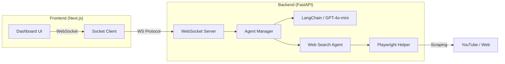

# 🎙️ NAVI: Voice-Powered AI Assistant

NAVI는 사용자의 음성 및 텍스트 명령을 이해하고 웹 검색, 앱 제어 및 정보 요약을 수행하는 지능형 AI 비서 서비스입니다.  
**Next.js**의 세련된 UI와 **FastAPI(Python)**의 강력한 AI 처리 능력을 결합하여, 단일 실행 파일(.exe)로 배포 가능한 **올인원(All-in-One) 네이티브 애플리케이션**으로 제작되었습니다.

---

## ✨ 주요 기능 (Key Features)

*   **🎙️ 실시간 음성/텍스트 분석**: LangChain(GPT-4o-mini)을 사용하여 자연어 명령의 의도를 정밀하게 분석합니다.
*   **🌐 스마트 웹 에이전트**: YouTube, 네이버 지도 등에서 사용자가 원하는 정보를 검색하고 구조화된 데이터로 제공합니다.
*   **💻 지능형 OS 제어**: uiautomation을 활용하여 메모장, 계산기 등 다양한 윈도우 애플리케이션을 자동으로 제어합니다.
*   **🧹 클린 아키텍처**: 모든 로직을 에이전트 단위로 리팩토링하여 유지보수성과 확장성을 극대화했습니다.
*   **🚀 무설치 단일 파일 배포**: Python이나 Node.js 설치 없이 `.exe` 하나만 실행하면 즉시 작동합니다.
*   **🤝 실시간 WebSocket 통신**: 사용자의 명령과 AI의 처리 과정을 지연 없이 화면에 실시간으로 반영합니다.
*   **🛡️ 개인정보 보호**: 민감한 정보(이메일, 패스워드 등)를 자동으로 감지하고 마스킹 처리하여 보안성을 확보했습니다.

---

## 🏗️ 아키텍처 (Architecture)

NAVI는 다음과 같이 Frontend와 Backend가 유기적으로 연결된 구조를 가집니다.



---

## 🚀 빠른 시작 (Getting Started)

### 📦 빌드된 앱 실행 (사용자용)
1.  [Releases] 섹션에서 최신 `NAVI_App.exe`를 다운로드합니다.
2.  파일을 실행하면 자동으로 전용 대시보드가 열립니다.

### 🛠️ 개발 환경 구축 (개발자용)

#### 1. 사전 요구 사항
*   Python 3.10 이상
*   Node.js 18.0 이상
*   OpenAI API Key (실행 시 환경 변수 필요)

#### 2. 저장소 클론 및 설정
```bash
git clone https://github.com/hjn5018/navi-jy.git
cd navi-jy

# 백엔드 가상환경 설정 및 의존성 설치
cd backend
python -m venv venv
source venv/Scripts/activate  # Windows: venv\Scripts\activate
pip install -r requirements.txt

# 프론트엔드 의존성 설치
cd ../client
npm install
```

---

## 📖 상세 문서 (Documentation)

더 자세한 정보는 아래 문서들을 참고해 주세요.

*   [🛠️ 기술 스택 및 개발 여정 딥다이브](docs/tech_deep_dive.md)
*   [📦 패키징 및 배포 가이드](docs/packaging_guide.md)
*   [📑 제품 요구 사항서 (PRD)](docs/NAVI_PRD.md)
*   [🚦 QA 및 테스트 플랜](docs/qa_test_plan.md)
*   [🔮 향후 로드맵](docs/future_roadmap.md)

---

## 📄 라이선스
이 프로젝트는 MIT 라이선스를 따릅니다.

---

**© 2026 NAVI Project Team. Empowering daily life with AI.**
