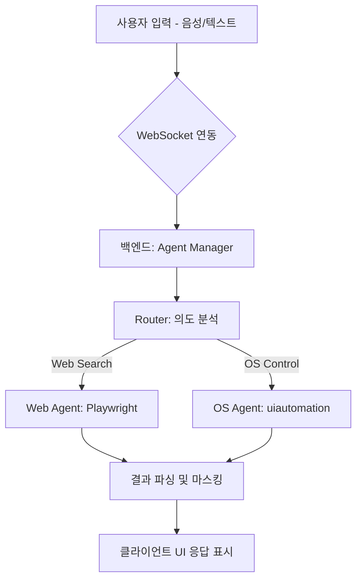

# 🏗️ NAVI 시스템 아키텍처 (Architecture)

## 🌌 기술 스택 (Tech Stack)
- **백엔드**: FastAPI (Python), WebSocket 연동
- **프론트엔드**: Next.js 16 (React), Tailwind CSS v4
- **AI/에이전트**: OpenAI GPT-4o-mini (의도 분석), Playwright (웹 자동화), uiautomation (Windows 자동화)

## 📊 시스템 흐름도 (Activity/ERD)
### 1. 주요 활동 다이어그램 (Activity Diagram)

### 2. 데이터베이스 스키마 정의 (ERD 요약)
- **Commands**: 사용자 발화 및 수행된 에이전트 결과 기록.
- **UserPreferences**: 사용자의 UI 모드(Compact/Dashboard), 음성 감도 설정 등 저장.

## ⚙️ PoC 결과 핵심 로직
- **Web Agent**: `youtube_search.py` 및 `web_agent.py`를 통해 3개 이상의 검색 정보를 실시간으로 추출함.
- **OS Agent**: `notepad_control_uia.py`를 통해 Windows 11 환경에서 메모장 인식 및 텍스트 대리 입력 성공.
