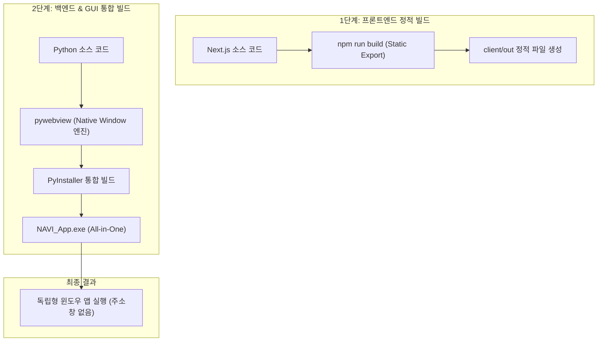

# 📦 NAVI 단일 실행 파일 (.exe) 제작 가이드

사용자가 아이콘 하나로 NAVI를 실행할 수 있게 만드는 과정입니다.

## 1. 전용 윈도우 앱 패키징 흐름 (Native App Workflow)



## 2. 상세 상세 작업 절차 및 빌드 명령어

### 1️⃣ 프론트엔드 (Next.js)
*   `next.config.js`에서 `output: 'export'` 설정을 추가하여 서버 없이도 브라우저에서 읽을 수 있는 HTML 파일 뭉치를 만듭니다.
*   빌드 결과물인 `client/out` 폴더를 백엔드 서버가 정적 파일로 서빙하도록 설정합니다.

### 2️⃣ 백엔드 & GUI 통합 (Python / pywebview)
*   **pywebview** 라이브러리를 사용하여 FastAPI 서버가 실행되는 동시에 주소창이 없는 전용 윈도우 창을 생성합니다.
*   백엔드 API는 별도의 스레드(`threading.Thread`)에서 실행하여 GUI 창과 병렬로 동작하게 합니다.

### 3️⃣ PyInstaller를 이용한 통합 패키징
실제 배포용 단일 실행 파일을 만드는 명령어는 다음과 같습니다 (모든 라이브러리 및 정적 데이터 포함):

```bash
python -m PyInstaller ^
  --onefile ^
  --noconsole ^
  --name NAVI_App ^
  --add-data "client/out;client/out" ^
  --add-data "backend;backend" ^
  --collect-all langchain ^
  --collect-all uvicorn ^
  --collect-all websockets ^
  --collect-all webview ^
  launcher.py
```

### 🏆 주요 설정 항목 설명
*   `--onefile`: 모든 라이브러리와 자산을 단 하나의 `.exe` 파일로 응축합니다.
*   `--noconsole`: 실행 시 배경에 검은색 터미널 창이 나타나지 않도록 가려줍니다.
*   `--add-data`: 프론트엔드 정적 파일(`.html`, `.js`)과 백엔드 로직 디렉토리를 실행 파일 내부 데이터 리소스로 포함합니다.
*   `--collect-all`: `langchain`, `uvicorn` 등 동적으로 로드되는 라이브러리의 모든 의존성을 누락 없이 패킹합니다.

---

## 🚀 유지보수 주의사항
*   **경로 관리**: 실행 파일 내부의 임시 경로(`sys._MEIPASS`)를 통해 파일을 찾도록 소스 코드 내 경로 처리가 되어 있어야 합니다.
*   **프로세스 종료**: GUI 창이 닫힐 때 백그라운드 스레드에서 돌아가는 API 서버도 함께 안전하게 종료되도록 설계가 필요합니다.
