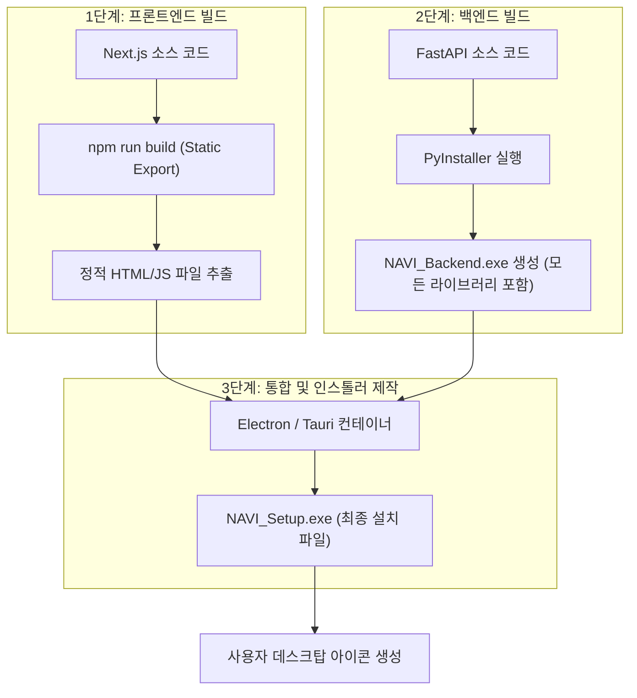

# 📦 NAVI 단일 실행 파일 (.exe) 제작 가이드

사용자가 아이콘 하나로 NAVI를 실행할 수 있게 만드는 과정입니다.

## 1. 전체 패키징 흐름도 (Packaging Workflow)

## 2. 상세 작업 절차

### 1️⃣ 프론트엔드 (Next.js)
*   `next.config.js`에서 `output: 'export'` 설정을 추가하여 서버 없이도 브라우저에서 읽을 수 있는 HTML 파일 뭉치를 만듭니다.
*   이 파일들은 최종 앱의 '화면' 역할을 하게 됩니다.

### 2️⃣ 백엔드 (FastAPI/Python)
*   **PyInstaller**를 사용하여 작성한 모든 파이썬 파일과 의존 라이브러리를 하나로 묶습니다.
*   `--onefile` 옵션을 사용하면 파일 하나만 남고, `--noconsole` 옵션을 사용하면 백그라운드에서 조용히 실행됩니다.

### 3️⃣ 통합 패킹 (Electron 등)
*   사용자가 아이콘을 클릭하면:
    1.  백엔드 `.exe`가 백그라운드에서 실행됩니다.
    2.  동시에 전용 윈도우 창이 떠서 빌드된 HTML 화면을 보여줍니다.
    3.  두 시스템은 내부에서 **WebSocket**으로 통신하며 작동합니다.

---

## 🚀 실습: 간단한 도구(.exe) 제작 체험
지금 바로 **백엔드 환경 진단 도구**를 실제 `.exe` 파일로 만드는 과정을 시연해 드릴 수 있습니다. (PyInstaller 이용)
