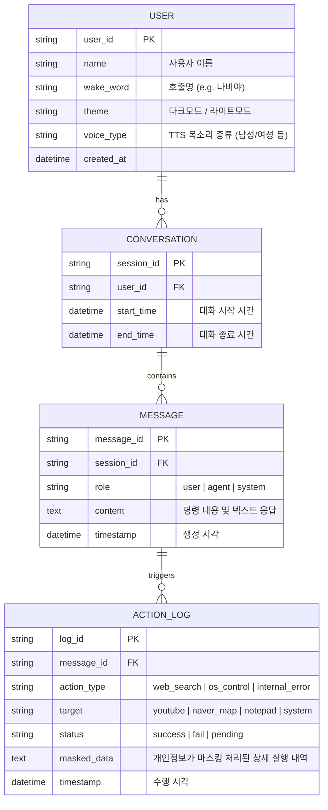

# NAVI 프로젝트 ERD (Entity Relationship Diagram)

## 핵심 테이블 설명
- **USER**: 사용자의 개인화 설정(호출명, 테마, TTS 종류 등)을 저장.
- **CONVERSATION**: 의미 단위의 대화 세션. 예를 들어, 앱이 켜져 있는 동안의 하나의 상호작용 호흡(컨텍스트) 유지.
- **MESSAGE**: 사용자의 STT 결과, 시스템의 내부 메시지, 그리고 NAVI가 돌려주는 텍스트 응답의 로그 체인.
- **ACTION_LOG**: 메시지에 의해 파생된 시스템의 실제 물리적/소프트웨어적 기동 내역을 저장 (보안을 위해 비밀번호 등은 해시나 `***` 형태로 `masked_data`에 저장됨).
