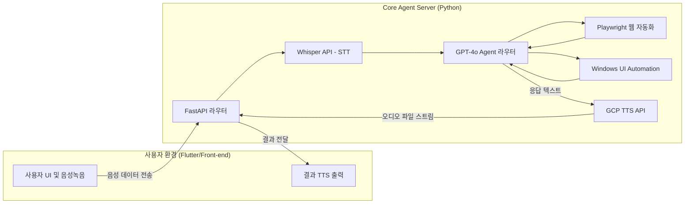

# NAVI 기술 스택 및 아키텍처 제안

초기 Windows 데스크톱 지원을 시작으로 향후 스마트폰(iOS/Web), Mac OS 등으로 확장이 용이한 'Client - Server' 분리형 구조를 가장 추천합니다.

## 1. 추천 아키텍처 다이어그램

## 2. 상세 기술 스택 후보군 및 선정

### 백엔드 (AI & Automation Core) - **[선정: Python + FastAPI]**
- **이유**: Playwright, LLM(LangChain), STT 분야에서 필수적인 패키지들을 모두 포함하는 생태계를 보유.
- **후보**: Node.js(Express)도 브라우저 자동화에 강하지만, LLM 연동성 및 OS Automation(pywinauto) 제어 스크립팅에서는 Python이 더 유연합니다.

### 프론트엔드 (Client App UI) - **[선정: Flutter]**
- **이유**: 단일 다트(Dart) 코드로 Windows, macOS 데스크톱 및 iOS/Android 네이티브 앱을 한 번에 빌드 가능. 오버레이 위젯이나 고급 애니메이션 구현이 용이합니다.
- **대안 (후보군)**: 
  - **Tauri + React/Next.js**: 웹 프론트엔드 개발에 친숙하다면 추천. 앱 크기가 작고 데스크톱에 최적화됨. 단, 추후 모바일 앱을 위해 React Native를 따로 구축해야 하는 단점이 있음.
  - **Python Flet / PyQt**: 백엔드와 프론트엔드를 완전한 일체형(Standalone)으로 가볍게 만들 때는 좋지만 커스텀 UI/UX 고도화나 스마트폰 앱 배포 시 한계가 명확함.

### AI 및 써드파티 API
- **의도 분석/작업 계획**: `LangChain` 프레임워크 기반 `OpenAI GPT-4o-mini` 사용 (응답 속도와 비용 절감의 밸런스).
- **STT (음성 -> 텍스트)**: `OpenAI Whisper API`.
- **TTS (텍스트 -> 음성)**: `Google Cloud Text-to-Speech API` (한국어 Wavenet 모델 퀄리티가 탁월함).
- **웹 자동화**: `Playwright` (동적 스크립트 실행 및 결과 파싱에 가장 빠르고 안정적).
- **오프라인 DB**: `SQLite` (유저 설정 기록 및 로그 보관용 임베디드 데이터베이스).
