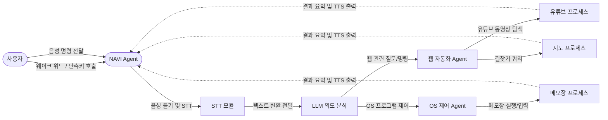
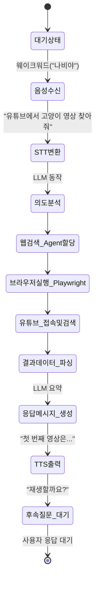

# NAVI - Use Case 및 Activity 시나리오

## 1. 시스템 Use Case 다이어그램

```mermaid
flowchart LR
    User([사용자])
    System([NAVI Agent])
    
    User -->|"웨이크 워드 / 단축키 호출"| System
    User -->|"음성 명령 전달"| System
    System -->|"음성 듣기 및 STT"| STT["STT 모듈"]
    STT -->|"텍스트 변환 전달"| LLM["LLM 의도 분석"]
    
    LLM -->|"웹 관련 질문/명령"| WebAgent["웹 자동화 Agent"]
    LLM -->|"OS 프로그램 제어"| OSAgent["OS 제어 Agent"]
    
    WebAgent -->|"유튜브 동영상 탐색"| Youtube["유튜브 프로세스"]
    WebAgent -->|"길찾기 쿼리"| Map["지도 프로세스"]
    
    OSAgent -->|"메모장 실행/입력"| Notepad["메모장 프로세스"]
    
    Youtube -.->|"결과 요약 및 TTS 출력"| System
    Map -.->|"결과 요약 및 TTS 출력"| System
    Notepad -.->|"결과 요약 및 TTS 출력"| System
```

## 2. 유튜브 검색 Activity 다이어그램

```mermaid
stateDiagram-v2
    [*] --> 대기상태
    대기상태 --> 음성수신 : 웨이크워드("나비야")
    음성수신 --> STT변환 : "유튜브에서 고양이 영상 찾아줘"
    STT변환 --> 의도분석 : LLM 동작
    의도분석 --> 웹검색_Agent할당
    웹검색_Agent할당 --> 브라우저실행_Playwright
    브라우저실행_Playwright --> 유튜브_접속및검색
    유튜브_접속및검색 --> 결과데이터_파싱
    결과데이터_파싱 --> 응답메시지_생성 : LLM 요약
    응답메시지_생성 --> TTS출력 : "첫 번째 영상은..."
    TTS출력 --> 후속질문_대기 : "재생할까요?"
    후속질문_대기 --> [*] : 사용자 응답 대기
```
