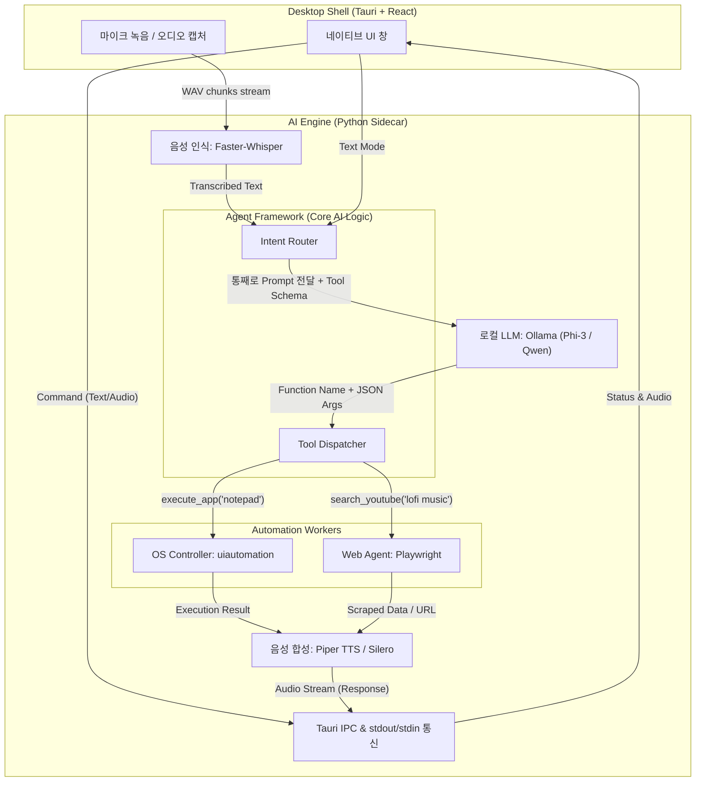

# NAVI V2 아키텍처 (Architecture)

## 시스템 개요 (System Overview)
V2는 로컬 환경에 최적화된 아키텍처를 가집니다. 외부 API 연결 없이 사용자의 음성과 텍스트만으로 모든 동작이 이루어지며, LLM의 Function Calling 기술을 활용해 사용자의 흐릿한 문맥이나 오타가 포함된 명령(STT 실패)도 정확한 프로그램 제어 및 검색 명령으로 변환합니다.

## 시스템 구성도 (System Architecture Diagram)

## 주요 컴포넌트 역할

1. **Desktop Shell (Tauri + React)**: 사용자가 명령을 내리고 과정/결과를 시각적으로 확인하는 매우 가벼운 네이티브 인터페이스. 바탕화면 상주 및 UI 렌더링.
2. **AI Engine (Python Sidecar)**: Tauri에서 백그라운드 프로세스로 실행되는 통제 허브. 표준 입출력(stdio) 또는 로컬 로컬 소켓을 통해 Tauri 프론트엔드와 실시간 JSON 로그를 통신.
3. **로컬 오디오 엔진 (STT & TTS)**:
   - Faster-Whisper를 통해 사용자의 음성을 C++ 기반으로 빠르게 추론하여 텍스트로 변환.
   - Piper TTS를 통해 즉각적인 음성 피드백(지연 시간 1초 미만) 생성.
4. **로컬 LLM & 라우팅 (Function Calling)**:
   - STT에서 오타가 발생(예: `유투브에서 뉴진스 틀어주`)해도 LLM이 문맥을 이해합니다.
   - LLM에 `[ { "name": "search_youtube", "description": "유튜브에서 검색", "parameters": {"query": "string"} } ]` 과 같이 JSON 스키마를 주입하여 명확한 인자 값(`"query": "뉴진스"`)을 돌려받습니다. 이를 통해 V1의 명령어 인식 실패율을 획기적으로 낮춥니다.
5. **Automation Workers**: 도출된 파라미터를 기반으로 실제 윈도우 OS 프로그램이나 브라우저를 백그라운드에서 제어.
